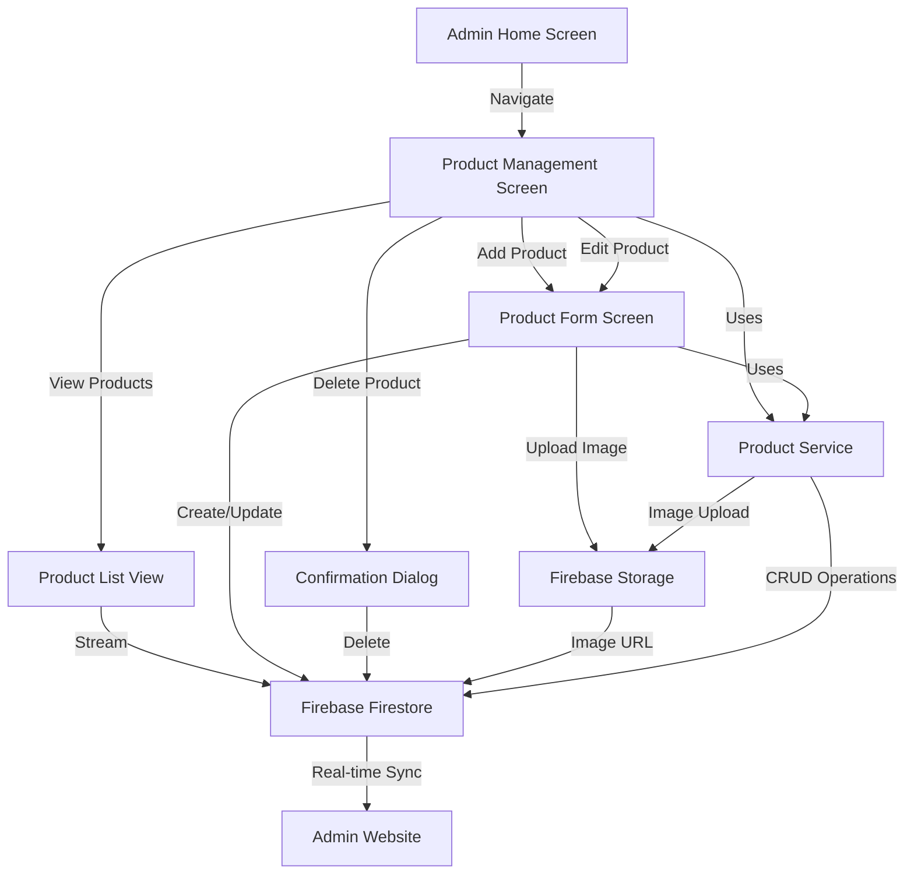
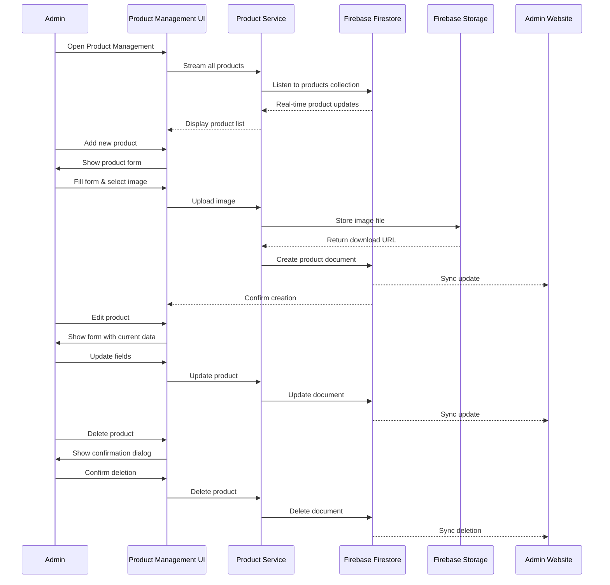

# Design Document: Admin Product Management

## Overview

The Admin Product Management feature provides a comprehensive interface for administrators to manage the product catalog in the Flutter app. This feature enables full CRUD (Create, Read, Update, Delete) operations on products, including image management, inventory tracking, and real-time synchronization with Firebase Firestore. The system is designed to work seamlessly with the existing admin website, sharing the same Firebase database to ensure data consistency across both platforms.

The feature includes a dedicated admin screen with product listing, search/filter capabilities, form-based product creation and editing, image upload to Firebase Storage, inventory management with stock alerts, and confirmation dialogs for destructive actions. All operations sync in real-time with the Firebase backend, ensuring changes made in the mobile app are immediately reflected on the admin website and vice versa.

## Architecture



## Main Workflow



## Components and Interfaces

### Component 1: ProductManagementScreen

**Purpose**: Main screen for managing products with list view, search, and navigation to add/edit screens

**Interface**:
```dart
class ProductManagementScreen extends StatefulWidget {
  const ProductManagementScreen({Key? key}) : super(key: key);
  
  @override
  State<ProductManagementScreen> createState() => _ProductManagementScreenState;
}

class _ProductManagementScreenState extends State<ProductManagementScreen> {
  String _searchQuery = '';
  String _filterCategory = 'all';
  
  void _navigateToAddProduct();
  void _navigateToEditProduct(Product product);
  void _deleteProduct(Product product);
  void _showDeleteConfirmation(Product product);
  List<Product> _filterProducts(List<Product> products);
}
```

**Responsibilities**:
- Display real-time list of all products from Firestore
- Provide search functionality by product name
- Filter products by category
- Navigate to add/edit product screens
- Handle product deletion with confirmation
- Show loading states and error messages


### Component 2: ProductFormScreen

**Purpose**: Form screen for creating new products or editing existing ones

**Interface**:
```dart
class ProductFormScreen extends StatefulWidget {
  final Product? product; // null for add, non-null for edit
  
  const ProductFormScreen({Key? key, this.product}) : super(key: key);
  
  @override
  State<ProductFormScreen> createState() => _ProductFormScreenState;
}

class _ProductFormScreenState extends State<ProductFormScreen> {
  final _formKey = GlobalKey<FormState>();
  final _nameController = TextEditingController();
  final _descriptionController = TextEditingController();
  final _priceController = TextEditingController();
  final _stockController = TextEditingController();
  String _selectedCategory = '';
  XFile? _selectedImage;
  String? _existingImageUrl;
  bool _isLoading = false;
  
  Future<void> _pickImage();
  Future<void> _saveProduct();
  String? _validateName(String? value);
  String? _validatePrice(String? value);
  String? _validateStock(String? value);
}
```

**Responsibilities**:
- Render form fields for all product attributes
- Validate all input fields before submission
- Handle image selection from device gallery
- Upload images to Firebase Storage
- Create new products or update existing ones
- Show loading indicators during save operations
- Display success/error messages


### Component 3: ProductService

**Purpose**: Service layer for all product-related Firebase operations

**Interface**:
```dart
class ProductService {
  final FirebaseFirestore _firestore = FirebaseFirestore.instance;
  final FirebaseStorage _storage = FirebaseStorage.instance;
  
  // CRUD Operations
  Stream<List<Product>> getAllProductsStream();
  Future<Product?> getProductById(String id);
  Future<String?> createProduct(Product product);
  Future<void> updateProduct(String id, Product product);
  Future<void> deleteProduct(String id);
  
  // Image Management
  Future<String?> uploadProductImage(XFile imageFile);
  Future<void> deleteProductImage(String imageUrl);
  
  // Inventory Management
  Future<void> updateStock(String id, int newStock);
  Future<void> incrementStock(String id, int amount);
  Future<void> decrementStock(String id, int amount);
  
  // Search and Filter
  Stream<List<Product>> searchProducts(String query);
  Stream<List<Product>> getProductsByCategory(String category);
}
```

**Responsibilities**:
- Manage all Firestore operations for products collection
- Handle image uploads to Firebase Storage
- Provide real-time streams for product data
- Implement search and filter logic
- Manage inventory updates
- Handle error cases and return appropriate responses


### Component 4: ProductCard

**Purpose**: Reusable widget for displaying product information in list view

**Interface**:
```dart
class ProductCard extends StatelessWidget {
  final Product product;
  final VoidCallback onEdit;
  final VoidCallback onDelete;
  final VoidCallback? onTap;
  
  const ProductCard({
    Key? key,
    required this.product,
    required this.onEdit,
    required this.onDelete,
    this.onTap,
  }) : super(key: key);
  
  @override
  Widget build(BuildContext context);
}
```

**Responsibilities**:
- Display product image, name, price, stock, and category
- Show low stock warning indicator
- Provide edit and delete action buttons
- Handle tap events for product details
- Display product information in a visually appealing card layout

## Data Models

### Model 1: Product (Existing)

```dart
class Product {
  final String id;
  final String name;
  final String description;
  final double price;
  final String image;
  final int stock;
  final String category;
  final DateTime createdAt;
  final DateTime updatedAt;
  
  Product({
    required this.id,
    required this.name,
    required this.description,
    required this.price,
    required this.image,
    required this.stock,
    required this.category,
    required this.createdAt,
    required this.updatedAt,
  });
  
  factory Product.fromMap(Map<String, dynamic> map, String id);
  Map<String, dynamic> toMap();
}
```


**Validation Rules**:
- `name`: Required, non-empty, max 100 characters
- `description`: Required, non-empty, max 500 characters
- `price`: Required, positive number, max 2 decimal places
- `stock`: Required, non-negative integer
- `category`: Required, non-empty, from predefined list
- `image`: Required, valid URL or file path

### Model 2: ProductFormData

```dart
class ProductFormData {
  String name;
  String description;
  double price;
  int stock;
  String category;
  XFile? imageFile;
  String? existingImageUrl;
  
  ProductFormData({
    this.name = '',
    this.description = '',
    this.price = 0.0,
    this.stock = 0,
    this.category = '',
    this.imageFile,
    this.existingImageUrl,
  });
  
  bool isValid();
  Product toProduct(String id, String imageUrl);
}
```

**Validation Rules**:
- All fields must pass Product model validation
- Either `imageFile` or `existingImageUrl` must be present
- Price must be formatted correctly (2 decimal places)
- Stock must be a valid integer

## Algorithmic Pseudocode

### Main Product Management Algorithm

```dart
// Algorithm: Display and manage product list
Stream<List<Product>> displayProducts(String searchQuery, String categoryFilter) {
  // INPUT: searchQuery (string), categoryFilter (string)
  // OUTPUT: Stream of filtered product list
  // PRECONDITION: Firebase connection is active
  // POSTCONDITION: Returns real-time stream of products matching filters
  
  return ProductService.getAllProductsStream()
    .map((products) {
      // Filter by search query
      if (searchQuery.isNotEmpty) {
        products = products.where((p) => 
          p.name.toLowerCase().contains(searchQuery.toLowerCase())
        ).toList();
      }
      
      // Filter by category
      if (categoryFilter != 'all') {
        products = products.where((p) => 
          p.category == categoryFilter
        ).toList();
      }
      
      // Sort by name alphabetically
      products.sort((a, b) => a.name.compareTo(b.name));
      
      return products;
    });
}
```


### Product Creation/Update Algorithm

```dart
// Algorithm: Save product (create or update)
Future<bool> saveProduct(ProductFormData formData, String? productId) async {
  // INPUT: formData (ProductFormData), productId (String? - null for create)
  // OUTPUT: Success boolean
  // PRECONDITION: formData.isValid() returns true
  // POSTCONDITION: Product is saved to Firestore, image uploaded to Storage
  
  try {
    // Step 1: Validate form data
    if (!formData.isValid()) {
      throw ValidationException('Invalid form data');
    }
    
    // Step 2: Handle image upload
    String imageUrl;
    if (formData.imageFile != null) {
      // Upload new image
      imageUrl = await ProductService.uploadProductImage(formData.imageFile!);
      
      // Delete old image if updating
      if (productId != null && formData.existingImageUrl != null) {
        await ProductService.deleteProductImage(formData.existingImageUrl!);
      }
    } else {
      // Keep existing image URL
      imageUrl = formData.existingImageUrl!;
    }
    
    // Step 3: Create product object
    final now = DateTime.now();
    final product = Product(
      id: productId ?? '',
      name: formData.name,
      description: formData.description,
      price: formData.price,
      image: imageUrl,
      stock: formData.stock,
      category: formData.category,
      createdAt: productId != null ? existingProduct.createdAt : now,
      updatedAt: now,
    );
    
    // Step 4: Save to Firestore
    if (productId == null) {
      await ProductService.createProduct(product);
    } else {
      await ProductService.updateProduct(productId, product);
    }
    
    return true;
  } catch (e) {
    print('Error saving product: $e');
    return false;
  }
}
```


### Product Deletion Algorithm

```dart
// Algorithm: Delete product with confirmation
Future<bool> deleteProduct(Product product, BuildContext context) async {
  // INPUT: product (Product), context (BuildContext)
  // OUTPUT: Success boolean
  // PRECONDITION: product.id is valid
  // POSTCONDITION: Product deleted from Firestore, image deleted from Storage
  
  // Step 1: Show confirmation dialog
  final confirmed = await showDialog<bool>(
    context: context,
    builder: (context) => AlertDialog(
      title: Text('Delete Product'),
      content: Text('Are you sure you want to delete "${product.name}"?'),
      actions: [
        TextButton(
          onPressed: () => Navigator.pop(context, false),
          child: Text('Cancel'),
        ),
        ElevatedButton(
          onPressed: () => Navigator.pop(context, true),
          child: Text('Delete'),
        ),
      ],
    ),
  );
  
  // Step 2: If not confirmed, return false
  if (confirmed != true) {
    return false;
  }
  
  // Step 3: Delete product
  try {
    // Delete image from Storage
    if (product.image.isNotEmpty) {
      await ProductService.deleteProductImage(product.image);
    }
    
    // Delete product document from Firestore
    await ProductService.deleteProduct(product.id);
    
    return true;
  } catch (e) {
    print('Error deleting product: $e');
    return false;
  }
}
```


### Image Upload Algorithm

```dart
// Algorithm: Upload product image to Firebase Storage
Future<String?> uploadProductImage(XFile imageFile) async {
  // INPUT: imageFile (XFile)
  // OUTPUT: Download URL (String) or null on failure
  // PRECONDITION: imageFile is valid and readable
  // POSTCONDITION: Image uploaded to Storage, returns download URL
  
  try {
    // Step 1: Generate unique filename
    final timestamp = DateTime.now().millisecondsSinceEpoch;
    final extension = imageFile.path.split('.').last;
    final fileName = 'product_${timestamp}.$extension';
    
    // Step 2: Create storage reference
    final ref = FirebaseStorage.instance
      .ref()
      .child('products')
      .child(fileName);
    
    // Step 3: Upload file
    final file = File(imageFile.path);
    final uploadTask = await ref.putFile(file);
    
    // Step 4: Get download URL
    final downloadUrl = await uploadTask.ref.getDownloadURL();
    
    return downloadUrl;
  } catch (e) {
    print('Error uploading image: $e');
    return null;
  }
}
```

## Key Functions with Formal Specifications

### Function 1: getAllProductsStream()

```dart
Stream<List<Product>> getAllProductsStream()
```

**Preconditions:**
- Firebase Firestore connection is active
- Products collection exists in Firestore

**Postconditions:**
- Returns a stream that emits product lists
- Stream updates in real-time when products change
- Products are sorted by createdAt descending (newest first)
- Empty list returned if no products exist

**Loop Invariants:** N/A (stream-based, no explicit loops)


### Function 2: createProduct()

```dart
Future<String?> createProduct(Product product)
```

**Preconditions:**
- `product` is non-null and valid
- `product.name` is non-empty
- `product.price` is positive
- `product.stock` is non-negative
- `product.image` is a valid URL
- Firebase Firestore connection is active

**Postconditions:**
- Product document created in Firestore 'products' collection
- Returns document ID on success
- Returns null on failure
- `createdAt` and `updatedAt` timestamps are set to current time
- Changes sync to admin website in real-time

**Loop Invariants:** N/A

### Function 3: updateProduct()

```dart
Future<void> updateProduct(String id, Product product)
```

**Preconditions:**
- `id` is non-empty and corresponds to existing product
- `product` is non-null and valid
- All product fields pass validation
- Firebase Firestore connection is active

**Postconditions:**
- Product document updated in Firestore
- `updatedAt` timestamp set to current time
- `createdAt` timestamp preserved from original
- Changes sync to admin website in real-time
- Throws exception on failure

**Loop Invariants:** N/A


### Function 4: deleteProduct()

```dart
Future<void> deleteProduct(String id)
```

**Preconditions:**
- `id` is non-empty and corresponds to existing product
- Firebase Firestore connection is active
- User has confirmed deletion

**Postconditions:**
- Product document removed from Firestore
- Associated image deleted from Firebase Storage
- Changes sync to admin website in real-time
- Throws exception on failure

**Loop Invariants:** N/A

### Function 5: validateProductForm()

```dart
bool validateProductForm(ProductFormData formData)
```

**Preconditions:**
- `formData` is non-null

**Postconditions:**
- Returns true if all validations pass
- Returns false if any validation fails
- No side effects on formData

**Loop Invariants:**
- For validation loops: All previously checked fields remain valid

## Example Usage

```dart
// Example 1: Navigate to Product Management from Admin Home
ElevatedButton(
  onPressed: () {
    Navigator.push(
      context,
      MaterialPageRoute(
        builder: (context) => const ProductManagementScreen(),
      ),
    );
  },
  child: Text('Manage Products'),
)

// Example 2: Display product list with real-time updates
StreamBuilder<List<Product>>(
  stream: ProductService().getAllProductsStream(),
  builder: (context, snapshot) {
    if (snapshot.connectionState == ConnectionState.waiting) {
      return CircularProgressIndicator();
    }
    
    final products = snapshot.data ?? [];
    
    return ListView.builder(
      itemCount: products.length,
      itemBuilder: (context, index) {
        return ProductCard(
          product: products[index],
          onEdit: () => _navigateToEditProduct(products[index]),
          onDelete: () => _deleteProduct(products[index]),
        );
      },
    );
  },
)
```


// Example 3: Create new product
final formData = ProductFormData(
  name: 'Premium Water Filter',
  description: 'High-quality water filtration system',
  price: 299.99,
  stock: 50,
  category: 'Filters',
  imageFile: selectedImage,
);

final success = await saveProduct(formData, null);
if (success) {
  ScaffoldMessenger.of(context).showSnackBar(
    SnackBar(content: Text('Product created successfully')),
  );
}

// Example 4: Update existing product
final formData = ProductFormData(
  name: 'Premium Water Filter - Updated',
  description: 'High-quality water filtration system with new features',
  price: 349.99,
  stock: 45,
  category: 'Filters',
  existingImageUrl: product.image,
);

final success = await saveProduct(formData, product.id);
if (success) {
  ScaffoldMessenger.of(context).showSnackBar(
    SnackBar(content: Text('Product updated successfully')),
  );
}

// Example 5: Delete product with confirmation
final deleted = await deleteProduct(product, context);
if (deleted) {
  ScaffoldMessenger.of(context).showSnackBar(
    SnackBar(content: Text('Product deleted successfully')),
  );
}

// Example 6: Search and filter products
final filteredProducts = displayProducts('filter', 'Filters');
```

## Correctness Properties

### Universal Quantification Statements

1. **Product Uniqueness**: ∀ products p1, p2 ∈ Products: p1.id = p2.id ⟹ p1 = p2
   - Each product has a unique ID in the system

2. **Price Validity**: ∀ product p ∈ Products: p.price > 0
   - All products must have positive prices

3. **Stock Non-Negativity**: ∀ product p ∈ Products: p.stock ≥ 0
   - Stock levels cannot be negative


4. **Timestamp Ordering**: ∀ product p ∈ Products: p.createdAt ≤ p.updatedAt
   - Update timestamp must be equal to or after creation timestamp

5. **Image Requirement**: ∀ product p ∈ Products: p.image ≠ null ∧ p.image ≠ ''
   - All products must have an associated image

6. **Name Uniqueness**: ∀ products p1, p2 ∈ Products: p1.id ≠ p2.id ⟹ p1.name ≠ p2.name
   - Product names should be unique (business rule)

7. **Category Validity**: ∀ product p ∈ Products: p.category ∈ ValidCategories
   - Product category must be from predefined list

8. **Real-time Sync**: ∀ operation op ∈ {create, update, delete}: op(product) ⟹ sync(website, product)
   - All operations sync to admin website in real-time

9. **Form Validation**: ∀ formData f: saveProduct(f) ⟹ f.isValid() = true
   - Products can only be saved if form data is valid

10. **Image Upload Success**: ∀ imageFile i: uploadProductImage(i) = url ⟹ url ≠ null ∧ isValidUrl(url)
    - Successful image uploads return valid URLs

## Error Handling

### Error Scenario 1: Network Connection Failure

**Condition**: Firebase connection lost during operation
**Response**: 
- Show error message to user
- Retry operation automatically (up to 3 times)
- Cache operation for later if retries fail
**Recovery**: 
- Restore connection and retry cached operations
- Notify user of success/failure

### Error Scenario 2: Invalid Form Data

**Condition**: User submits form with invalid data
**Response**:
- Highlight invalid fields in red
- Display specific error messages below each field
- Prevent form submission
**Recovery**:
- User corrects invalid fields
- Form validates in real-time as user types


### Error Scenario 3: Image Upload Failure

**Condition**: Image upload to Firebase Storage fails
**Response**:
- Show error message: "Failed to upload image. Please try again."
- Keep form data intact
- Allow user to retry upload
**Recovery**:
- User selects image again or retries upload
- System attempts upload with exponential backoff

### Error Scenario 4: Product Not Found

**Condition**: Attempting to edit/delete non-existent product
**Response**:
- Show error message: "Product not found. It may have been deleted."
- Navigate back to product list
- Refresh product list
**Recovery**:
- User sees updated product list
- Can perform operations on existing products

### Error Scenario 5: Duplicate Product Name

**Condition**: Creating product with name that already exists
**Response**:
- Show validation error: "A product with this name already exists"
- Highlight name field
- Suggest alternative names
**Recovery**:
- User modifies product name
- System validates uniqueness in real-time

### Error Scenario 6: Insufficient Storage Space

**Condition**: Firebase Storage quota exceeded
**Response**:
- Show error message: "Storage limit reached. Please contact administrator."
- Log error for admin review
- Prevent image upload
**Recovery**:
- Administrator increases storage quota
- User retries upload

### Error Scenario 7: Permission Denied

**Condition**: User lacks permissions for operation
**Response**:
- Show error message: "You don't have permission to perform this action"
- Log security event
- Redirect to appropriate screen
**Recovery**:
- Administrator grants necessary permissions
- User retries operation


## Testing Strategy

### Unit Testing Approach

**Test Coverage Goals**: 80% code coverage minimum

**Key Test Cases**:

1. **Product Model Tests**
   - Test `fromMap()` with valid data
   - Test `fromMap()` with missing fields
   - Test `toMap()` serialization
   - Test date parsing and formatting

2. **ProductService Tests**
   - Mock Firestore operations
   - Test `createProduct()` success and failure
   - Test `updateProduct()` success and failure
   - Test `deleteProduct()` success and failure
   - Test `getAllProductsStream()` data flow
   - Test image upload success and failure

3. **Form Validation Tests**
   - Test name validation (empty, too long, special characters)
   - Test price validation (negative, zero, invalid format)
   - Test stock validation (negative, non-integer)
   - Test category validation (empty, invalid category)
   - Test image validation (missing, invalid format)

4. **Search and Filter Tests**
   - Test search with matching products
   - Test search with no matches
   - Test category filter
   - Test combined search and filter

### Property-Based Testing Approach

**Property Test Library**: Not applicable for this feature (UI-heavy, Firebase integration)

**Alternative Approach**: Integration tests with Firebase Emulator

### Integration Testing Approach

**Firebase Emulator Setup**:
- Use Firebase Emulator Suite for Firestore and Storage
- Test real-time sync behavior
- Test concurrent operations
- Test offline/online transitions

**Key Integration Tests**:

1. **End-to-End Product Creation**
   - Navigate to add product screen
   - Fill form with valid data
   - Select image
   - Submit form
   - Verify product appears in list
   - Verify image uploaded to Storage
   - Verify data in Firestore

2. **End-to-End Product Update**
   - Select existing product
   - Navigate to edit screen
   - Modify fields
   - Change image
   - Submit form
   - Verify updates in list
   - Verify old image deleted
   - Verify new image uploaded

3. **End-to-End Product Deletion**
   - Select product to delete
   - Confirm deletion
   - Verify product removed from list
   - Verify image deleted from Storage
   - Verify document deleted from Firestore

4. **Real-time Sync Test**
   - Open app on two devices/emulators
   - Create product on device 1
   - Verify product appears on device 2
   - Update product on device 2
   - Verify update appears on device 1


## Performance Considerations

### Image Optimization
- Compress images before upload (max 1MB per image)
- Generate thumbnails for list view (150x150px)
- Use cached network images to reduce bandwidth
- Implement lazy loading for product images

### Pagination
- Implement pagination for product list (20 products per page)
- Use Firestore query cursors for efficient pagination
- Load more products as user scrolls (infinite scroll)

### Caching Strategy
- Cache product list locally using Hive or SharedPreferences
- Implement offline-first approach with sync on connection
- Cache images using cached_network_image package
- Invalidate cache on CRUD operations

### Query Optimization
- Create Firestore indexes for common queries
- Use composite indexes for search + filter operations
- Limit real-time listeners to active screens only
- Unsubscribe from streams when screen disposed

### Memory Management
- Dispose controllers and streams properly
- Use const constructors where possible
- Implement image memory cache limits
- Clear image cache periodically

## Security Considerations

### Authentication and Authorization
- Verify user is admin before allowing access to product management
- Check admin role on every operation (client and server-side)
- Implement Firebase Security Rules for products collection
- Log all admin actions for audit trail

### Firebase Security Rules

```javascript
rules_version = '2';
service cloud.firestore {
  match /databases/{database}/documents {
    match /products/{productId} {
      // Allow read for all authenticated users
      allow read: if request.auth != null;
      
      // Allow write only for admin users
      allow create, update, delete: if request.auth != null 
        && get(/databases/$(database)/documents/users/$(request.auth.uid)).data.userType == 'admin';
    }
  }
}

service firebase.storage {
  match /b/{bucket}/o {
    match /products/{imageId} {
      // Allow read for all authenticated users
      allow read: if request.auth != null;
      
      // Allow write only for admin users
      allow write: if request.auth != null 
        && firestore.get(/databases/(default)/documents/users/$(request.auth.uid)).data.userType == 'admin';
    }
  }
}
```


### Input Validation
- Sanitize all user inputs before saving
- Validate file types for image uploads (jpg, png, webp only)
- Limit file sizes (max 5MB per image)
- Prevent SQL injection (not applicable for Firestore)
- Prevent XSS attacks in product descriptions

### Data Privacy
- Don't log sensitive product information
- Encrypt sensitive data at rest (handled by Firebase)
- Use HTTPS for all communications (handled by Firebase)
- Implement proper error messages (no sensitive data leakage)

### Rate Limiting
- Implement client-side rate limiting for operations
- Prevent spam/abuse of create/update operations
- Use Firebase App Check for bot protection

## Dependencies

### Flutter Packages

```yaml
dependencies:
  flutter:
    sdk: flutter
  
  # Firebase
  firebase_core: ^2.24.0
  cloud_firestore: ^4.13.0
  firebase_storage: ^11.5.0
  firebase_auth: ^4.15.0
  
  # Image Handling
  image_picker: ^1.0.5
  cached_network_image: ^3.3.0
  image: ^4.1.3  # For image compression
  
  # State Management
  provider: ^6.1.1
  
  # UI Components
  flutter_spinkit: ^5.2.0  # Loading indicators
  
  # Utilities
  intl: ^0.18.1  # Date formatting
  
dev_dependencies:
  flutter_test:
    sdk: flutter
  mockito: ^5.4.3  # For mocking in tests
  fake_cloud_firestore: ^2.4.2  # For Firestore testing
  firebase_storage_mocks: ^0.6.1  # For Storage testing
```

### External Services
- **Firebase Firestore**: NoSQL database for product data
- **Firebase Storage**: Cloud storage for product images
- **Firebase Authentication**: User authentication and authorization

### Existing Project Dependencies
- Product model (`lib/models/product.dart`)
- DatabaseService (`lib/services/database_service.dart`)
- AppTheme (`lib/theme.dart`)
- AppLocalizations (`lib/l10n/app_localizations.dart`)

### Platform Requirements
- **Minimum SDK**: Flutter 3.0.0
- **Android**: minSdkVersion 21 (Android 5.0)
- **iOS**: iOS 12.0 or higher
- **Web**: Modern browsers with JavaScript enabled
