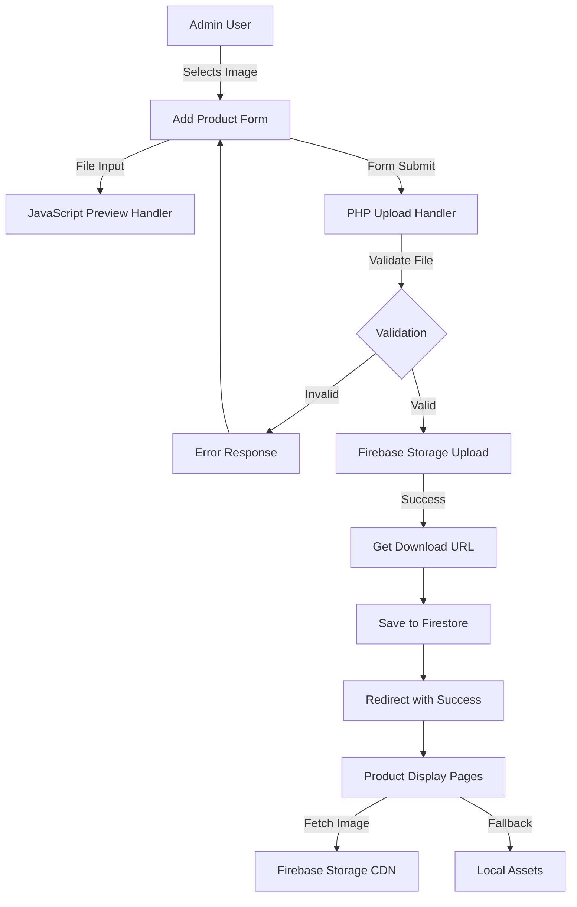
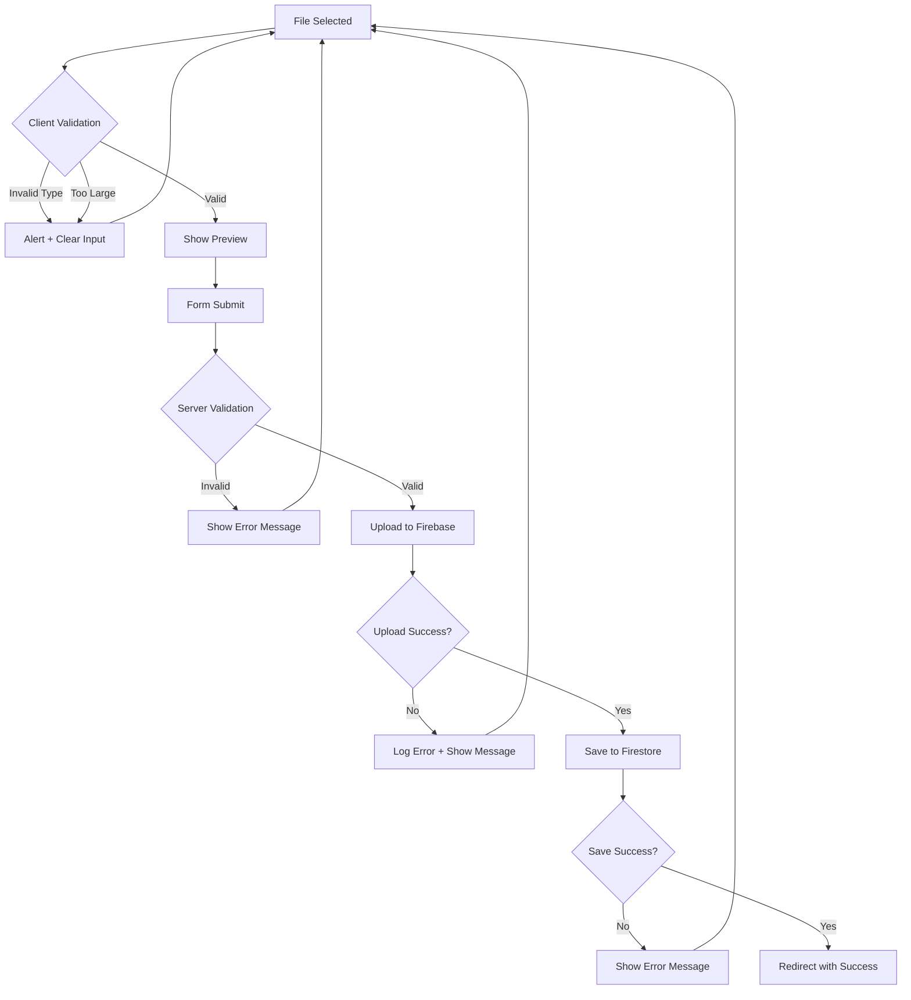

# Design Document: Image Upload Feature

## Overview

This design document specifies the technical implementation for adding image upload functionality to the Add Product page in the admin panel. The feature enables admin users to upload product images from their local device, store them in Firebase Storage, and display them throughout the website with full bilingual support (English/Arabic).

The implementation builds upon the existing partially-implemented upload logic in `add_product.php` and extends it with:
- Frontend file input with live image preview
- Client-side file validation
- Firebase Storage integration with proper configuration
- Comprehensive error handling with bilingual messages
- Backward compatibility for existing products with local image paths

### Key Design Decisions

1. **Firebase Storage over Local Storage**: Images are stored in Firebase Storage rather than the local filesystem to enable:
   - Scalable cloud storage
   - CDN-backed delivery
   - Consistent access across distributed environments
   - No server filesystem management

2. **Progressive Enhancement**: The form works without JavaScript but provides enhanced preview functionality when JavaScript is available

3. **Backward Compatibility**: Existing products with local image paths (e.g., "vest.jpeg") continue to work by detecting URL patterns and prepending the local path prefix

4. **Bilingual-First Design**: All user-facing text uses translation keys to support English and Arabic seamlessly

## Architecture

### System Components



### Data Flow

1. **Upload Flow**:
   - User selects image file → JavaScript displays preview
   - User submits form → PHP receives multipart/form-data
   - PHP validates file type, size, MIME type
   - PHP uploads to Firebase Storage via REST API
   - PHP retrieves public download URL
   - PHP saves product data with image URL to Firestore
   - User redirected to prevent resubmission

2. **Display Flow**:
   - Product page loads → Checks image field
   - If Firebase URL → Display directly
   - If local path → Prepend "../assets/products/"
   - If empty/null → Display placeholder.svg
   - If load fails → onerror fallback to placeholder

## Components and Interfaces

### 1. Frontend Form Component

**File**: `salamtak_web/admin/add_product.php` (HTML/JavaScript section)

**HTML Structure**:
```html
<div class="form-group">
    <label><?= t('upload_product_image') ?></label>
    <input type="file" 
           name="product_image" 
           id="product_image" 
           accept="image/jpeg,image/jpg,image/png,image/gif,image/webp"
           onchange="previewImage(event)">
    <small><?= t('max_file_size_5mb') ?></small>
</div>

<div class="form-group">
    <label><?= t('image_preview') ?></label>
    <div id="image-preview-container" class="image-preview">
        
        <div id="preview-placeholder" class="preview-placeholder">
            <svg><!-- Upload icon --></svg>
            <p><?= t('no_image_selected') ?></p>
        </div>
        <p id="image-filename" class="image-filename"></p>
    </div>
</div>
```

**Form Attributes**:
- `enctype="multipart/form-data"` - Required for file uploads
- `method="POST"` - Standard form submission

**JavaScript Preview Function**:
```javascript
function previewImage(event) {
    const file = event.target.files[0];
    const preview = document.getElementById('image-preview');
    const placeholder = document.getElementById('preview-placeholder');
    const filename = document.getElementById('image-filename');
    
    if (file) {
        // Validate file type
        const allowedTypes = ['image/jpeg', 'image/jpg', 'image/png', 'image/gif', 'image/webp'];
        if (!allowedTypes.includes(file.type)) {
            alert('<?= t('invalid_file_type') ?>');
            event.target.value = '';
            return;
        }
        
        // Validate file size (5MB)
        if (file.size > 5000000) {
            alert('<?= t('file_too_large') ?>');
            event.target.value = '';
            return;
        }
        
        // Display preview
        const reader = new FileReader();
        reader.onload = function(e) {
            preview.src = e.target.result;
            preview.style.display = 'block';
            placeholder.style.display = 'none';
            filename.textContent = file.name;
        };
        reader.readAsDataURL(file);
    } else {
        preview.style.display = 'none';
        placeholder.style.display = 'flex';
        filename.textContent = '';
    }
}
```

### 2. Backend Upload Handler

**File**: `salamtak_web/admin/add_product.php` (PHP section)

**Upload Processing Logic**:
```php
if (isset($_FILES['product_image']) && $_FILES['product_image']['error'] === UPLOAD_ERR_OK) {
    $file = $_FILES['product_image'];
    $fileName = $file['name'];
    $fileTmpName = $file['tmp_name'];
    $fileSize = $file['size'];
    
    // Validate file extension
    $fileExt = strtolower(pathinfo($fileName, PATHINFO_EXTENSION));
    $allowed = ['jpg', 'jpeg', 'png', 'gif', 'webp'];
    
    if (!in_array($fileExt, $allowed)) {
        $error = t('invalid_file_type_error');
    } elseif ($fileSize > 5000000) {
        $error = t('file_size_exceeded_error');
    } else {
        // Get MIME type and validate
        $mimeType = mime_content_type($fileTmpName);
        $validMimeTypes = [
            'jpg' => 'image/jpeg',
            'jpeg' => 'image/jpeg',
            'png' => 'image/png',
            'gif' => 'image/gif',
            'webp' => 'image/webp'
        ];
        
        if ($mimeType !== $validMimeTypes[$fileExt]) {
            $error = t('mime_type_mismatch_error');
        } else {
            // Generate unique filename
            $timestamp = time();
            $random = bin2hex(random_bytes(8));
            $newFileName = "product_{$timestamp}_{$random}.{$fileExt}";
            
            // Upload to Firebase Storage
            $imageUrl = uploadToFirebaseStorage($fileTmpName, $newFileName, $mimeType);
            
            if ($imageUrl === false) {
                $error = t('firebase_upload_failed');
            }
        }
    }
}
```

**Firebase Storage Upload Function**:
```php
function uploadToFirebaseStorage($filePath, $fileName, $mimeType) {
    $storagePath = "products/{$fileName}";
    $uploadUrl = "https://firebasestorage.googleapis.com/v0/b/" . 
                 FIREBASE_STORAGE_BUCKET . 
                 "/o/" . 
                 urlencode($storagePath);
    
    // Read file content
    $fileContent = file_get_contents($filePath);
    
    // Initialize cURL
    $ch = curl_init($uploadUrl);
    curl_setopt($ch, CURLOPT_RETURNTRANSFER, true);
    curl_setopt($ch, CURLOPT_POST, true);
    curl_setopt($ch, CURLOPT_POSTFIELDS, $fileContent);
    curl_setopt($ch, CURLOPT_HTTPHEADER, [
        'Content-Type: ' . $mimeType,
        'Content-Length: ' . strlen($fileContent)
    ]);
    
    $response = curl_exec($ch);
    $httpCode = curl_getinfo($ch, CURLINFO_HTTP_CODE);
    curl_close($ch);
    
    if ($httpCode === 200) {
        // Construct download URL
        $downloadUrl = "https://firebasestorage.googleapis.com/v0/b/" . 
                       FIREBASE_STORAGE_BUCKET . 
                       "/o/" . 
                       urlencode($storagePath) . 
                       "?alt=media";
        return $downloadUrl;
    }
    
    // Log error for debugging
    error_log("Firebase Storage upload failed. HTTP Code: {$httpCode}, Response: {$response}");
    return false;
}
```

### 3. Configuration Component

**File**: `salamtak_web/config.php`

**New Constant**:
```php
// Firebase Storage Configuration
define('FIREBASE_STORAGE_BUCKET', 'salmtak-6fffe.appspot.com');
```

**Usage**: This constant is used to construct Firebase Storage API URLs for both upload and download operations.

### 4. Translation Component

**File**: `salamtak_web/translations.php`

**New Translation Keys**:
```php
return [
    'en' => [
        // Image Upload
        'upload_product_image' => 'Upload Product Image',
        'select_image_file' => 'Select Image File',
        'image_preview' => 'Image Preview',
        'no_image_selected' => 'No image selected',
        'max_file_size_5mb' => 'Maximum file size: 5MB. Supported formats: JPG, PNG, GIF, WEBP',
        'invalid_file_type' => 'Invalid file type. Please select a JPG, PNG, GIF, or WEBP image.',
        'file_too_large' => 'File size exceeds 5MB limit. Please select a smaller image.',
        'invalid_file_type_error' => 'Invalid file type. Only JPG, JPEG, PNG, GIF, and WEBP are allowed.',
        'file_size_exceeded_error' => 'File size too large. Maximum 5MB allowed.',
        'mime_type_mismatch_error' => 'File type does not match file extension.',
        'firebase_upload_failed' => 'Failed to upload image to storage. Please try again.',
        'image_uploaded_successfully' => 'Image uploaded successfully!',
    ],
    'ar' => [
        // Image Upload
        'upload_product_image' => 'تحميل صورة المنتج',
        'select_image_file' => 'اختر ملف الصورة',
        'image_preview' => 'معاينة الصورة',
        'no_image_selected' => 'لم يتم اختيار صورة',
        'max_file_size_5mb' => 'الحد الأقصى لحجم الملف: 5 ميجابايت. الصيغ المدعومة: JPG، PNG، GIF، WEBP',
        'invalid_file_type' => 'نوع ملف غير صالح. يرجى اختيار صورة JPG أو PNG أو GIF أو WEBP.',
        'file_too_large' => 'حجم الملف يتجاوز حد 5 ميجابايت. يرجى اختيار صورة أصغر.',
        'invalid_file_type_error' => 'نوع ملف غير صالح. يُسمح فقط بـ JPG و JPEG و PNG و GIF و WEBP.',
        'file_size_exceeded_error' => 'حجم الملف كبير جدًا. الحد الأقصى المسموح به 5 ميجابايت.',
        'mime_type_mismatch_error' => 'نوع الملف لا يتطابق مع امتداد الملف.',
        'firebase_upload_failed' => 'فشل تحميل الصورة إلى التخزين. يرجى المحاولة مرة أخرى.',
        'image_uploaded_successfully' => 'تم تحميل الصورة بنجاح!',
    ]
];
```

### 5. Image Display Component

**Files**: All product display pages (products.php, product_detail.php, etc.)

**Display Logic**:
```php
function getProductImageUrl($product) {
    $imageField = $product['image'] ?? '';
    
    // Check if empty or null
    if (empty($imageField)) {
        return '../assets/products/placeholder.svg';
    }
    
    // Check if Firebase Storage URL
    if (strpos($imageField, 'firebasestorage.googleapis.com') !== false) {
        return $imageField;
    }
    
    // Check if already a full path
    if (strpos($imageField, '../assets/') === 0 || strpos($imageField, 'assets/') === 0) {
        return $imageField;
    }
    
    // Assume local filename, prepend path
    return '../assets/products/' . $imageField;
}
```

**HTML Usage**:
```html
" 
     alt="<?= htmlspecialchars($product['name']) ?>"
     onerror="this.src='../assets/products/placeholder.svg'">
```

## Data Models

### Product Document (Firestore)

```json
{
  "id": "auto-generated-id",
  "name": "string",
  "description": "string",
  "price": "number (float)",
  "stock": "number (integer)",
  "category": "string",
  "image": "string (Firebase Storage URL or local path)",
  "createdAt": "string (Y-m-d H:i:s)",
  "updatedAt": "string (Y-m-d H:i:s)"
}
```

**Image Field Patterns**:
- Firebase Storage URL: `https://firebasestorage.googleapis.com/v0/b/salmtak-6fffe.appspot.com/o/products%2Fproduct_1234567890_abc123.jpg?alt=media`
- Local path (legacy): `vest.jpeg` or `../assets/products/vest.jpeg`
- Empty: `""` (empty string)

### File Upload Data ($_FILES)

```php
$_FILES['product_image'] = [
    'name' => 'original-filename.jpg',
    'type' => 'image/jpeg',
    'tmp_name' => '/tmp/phpXXXXXX',
    'error' => 0,  // UPLOAD_ERR_OK
    'size' => 1234567  // bytes
]
```

### Firebase Storage Upload Request

**Endpoint**: `POST https://firebasestorage.googleapis.com/v0/b/{bucket}/o/{path}`

**Headers**:
```
Content-Type: image/jpeg
Content-Length: 1234567
```

**Body**: Raw binary file content

**Response** (Success - 200):
```json
{
  "name": "products/product_1234567890_abc123.jpg",
  "bucket": "salmtak-6fffe.appspot.com",
  "generation": "1234567890123456",
  "metageneration": "1",
  "contentType": "image/jpeg",
  "timeCreated": "2024-01-01T12:00:00.000Z",
  "updated": "2024-01-01T12:00:00.000Z",
  "storageClass": "STANDARD",
  "size": "1234567",
  "md5Hash": "...",
  "contentEncoding": "identity",
  "contentDisposition": "inline; filename*=utf-8''product_1234567890_abc123.jpg",
  "crc32c": "...",
  "etag": "...",
  "downloadTokens": "..."
}
```

## Error Handling

### Error Categories and Responses

| Error Type | Detection Point | HTTP Code | User Message | Action |
|------------|----------------|-----------|--------------|--------|
| No file selected | PHP | N/A | None (optional field) | Continue with empty image field |
| Invalid file type | JavaScript + PHP | N/A | `t('invalid_file_type')` | Clear file input, show error |
| File too large | JavaScript + PHP | N/A | `t('file_too_large')` | Clear file input, show error |
| MIME type mismatch | PHP | N/A | `t('mime_type_mismatch_error')` | Show error, don't upload |
| Firebase upload failed | PHP | 400-500 | `t('firebase_upload_failed')` + HTTP code | Log error, show message |
| Firestore save failed | PHP | 400-500 | `t('failed_to_add_product')` | Show error, don't redirect |

### Error Handling Flow



### Validation Rules

**Client-Side (JavaScript)**:
1. File type: Must be in `['image/jpeg', 'image/jpg', 'image/png', 'image/gif', 'image/webp']`
2. File size: Must be ≤ 5,000,000 bytes (5MB)

**Server-Side (PHP)**:
1. File extension: Must be in `['jpg', 'jpeg', 'png', 'gif', 'webp']`
2. File size: Must be < 5,000,000 bytes
3. MIME type: Must match extension:
   - jpg/jpeg → image/jpeg
   - png → image/png
   - gif → image/gif
   - webp → image/webp
4. Upload error: `$_FILES['product_image']['error']` must be `UPLOAD_ERR_OK` (0)

### Error Logging

```php
// Log Firebase Storage errors
if ($httpCode !== 200) {
    error_log(sprintf(
        "Firebase Storage upload failed - File: %s, HTTP Code: %d, Response: %s",
        $fileName,
        $httpCode,
        $response
    ));
}

// Log Firestore errors
if (!$product_id) {
    error_log(sprintf(
        "Firestore save failed - Product: %s, Image URL: %s",
        $name,
        $imageUrl
    ));
}
```

## Testing Strategy

### Unit Tests

**Test File**: `tests/ImageUploadTest.php`

**Test Cases**:

1. **File Validation Tests**:
   - Test valid file extensions (jpg, jpeg, png, gif, webp)
   - Test invalid file extensions (exe, pdf, txt)
   - Test file size validation (under 5MB, exactly 5MB, over 5MB)
   - Test MIME type validation for each allowed type
   - Test MIME type mismatch detection

2. **Filename Generation Tests**:
   - Test unique filename generation format
   - Test filename includes timestamp
   - Test filename includes random component
   - Test filename preserves extension

3. **URL Construction Tests**:
   - Test Firebase Storage upload URL construction
   - Test Firebase Storage download URL construction
   - Test URL encoding of storage path

4. **Image Display Logic Tests**:
   - Test Firebase URL detection and passthrough
   - Test local path detection and prefix addition
   - Test empty/null handling with fallback
   - Test various path formats (with/without prefix)

**Example Test**:
```php
public function testValidFileExtensions() {
    $validExtensions = ['jpg', 'jpeg', 'png', 'gif', 'webp'];
    foreach ($validExtensions as $ext) {
        $this->assertTrue(isValidFileExtension($ext));
    }
}

public function testInvalidFileExtensions() {
    $invalidExtensions = ['exe', 'pdf', 'txt', 'doc'];
    foreach ($invalidExtensions as $ext) {
        $this->assertFalse(isValidFileExtension($ext));
    }
}

public function testFileSizeValidation() {
    $this->assertTrue(isValidFileSize(4999999));  // Under limit
    $this->assertTrue(isValidFileSize(5000000));  // Exactly at limit
    $this->assertFalse(isValidFileSize(5000001)); // Over limit
}
```

### Integration Tests

**Test File**: `tests/ImageUploadIntegrationTest.php`

**Test Cases**:

1. **End-to-End Upload Flow**:
   - Upload a valid image file
   - Verify Firebase Storage receives the file
   - Verify download URL is returned
   - Verify Firestore document contains correct URL
   - Verify image is accessible via URL

2. **Form Submission Tests**:
   - Submit form with image
   - Submit form without image
   - Submit form with invalid image
   - Verify appropriate redirects and messages

3. **Backward Compatibility Tests**:
   - Create product with local image path
   - Verify display logic handles local paths
   - Create product with Firebase URL
   - Verify display logic handles Firebase URLs
   - Create product with empty image
   - Verify fallback to placeholder

4. **Bilingual Tests**:
   - Test error messages in English
   - Test error messages in Arabic
   - Test form labels in both languages
   - Verify translation keys exist for all messages

**Example Test**:
```php
public function testCompleteUploadFlow() {
    // Prepare test image
    $testImage = $this->createTestImage('test.jpg', 'image/jpeg', 1000000);
    
    // Simulate file upload
    $_FILES['product_image'] = $testImage;
    $_POST['name'] = 'Test Product';
    $_POST['price'] = 99.99;
    $_POST['add_product'] = true;
    
    // Execute upload handler
    ob_start();
    include 'admin/add_product.php';
    $output = ob_get_clean();
    
    // Verify Firebase Storage was called
    $this->assertFirebaseStorageUploadCalled();
    
    // Verify Firestore document created
    $products = queryFirestoreCollection('products', 'name', 'Test Product');
    $this->assertCount(1, $products);
    $this->assertStringContainsString('firebasestorage.googleapis.com', $products[0]['image']);
}
```

### Manual Testing Checklist

- [ ] Upload JPG image successfully
- [ ] Upload PNG image successfully
- [ ] Upload GIF image successfully
- [ ] Upload WEBP image successfully
- [ ] Attempt to upload invalid file type (should fail)
- [ ] Attempt to upload file over 5MB (should fail)
- [ ] Preview displays correctly before upload
- [ ] Preview updates when selecting different image
- [ ] Form submits without image (optional field)
- [ ] Success message displays after upload
- [ ] Error messages display for validation failures
- [ ] Uploaded image displays on products page
- [ ] Fallback to placeholder for products without images
- [ ] Existing products with local paths still display
- [ ] All text displays correctly in English
- [ ] All text displays correctly in Arabic
- [ ] RTL layout works correctly in Arabic mode

### Firebase Storage Configuration Testing

**Manual Verification Steps**:

1. Verify Firebase Storage bucket exists:
   - Navigate to Firebase Console → Storage
   - Confirm bucket name: `salmtak-6fffe.appspot.com`

2. Verify public read access:
   - Check Storage Rules in Firebase Console
   - Ensure rule allows public read for `products/` path:
   ```
   rules_version = '2';
   service firebase.storage {
     match /b/{bucket}/o {
       match /products/{allPaths=**} {
         allow read: if true;
         allow write: if request.auth != null;
       }
     }
   }
   ```

3. Test upload via cURL:
   ```bash
   curl -X POST \
     "https://firebasestorage.googleapis.com/v0/b/salmtak-6fffe.appspot.com/o/products%2Ftest.jpg" \
     -H "Content-Type: image/jpeg" \
     --data-binary "@test.jpg"
   ```

4. Test download URL:
   ```bash
   curl "https://firebasestorage.googleapis.com/v0/b/salmtak-6fffe.appspot.com/o/products%2Ftest.jpg?alt=media"
   ```

## Implementation Notes

### Security Considerations

1. **File Type Validation**: Both client-side and server-side validation prevent malicious file uploads
2. **File Size Limits**: 5MB limit prevents DoS attacks via large file uploads
3. **MIME Type Verification**: Prevents file extension spoofing
4. **Unique Filenames**: Timestamp + random bytes prevent filename collisions and predictability
5. **Firebase Storage Rules**: Write access requires authentication (admin only)
6. **Input Sanitization**: All user inputs are sanitized before display using `htmlspecialchars()`

### Performance Considerations

1. **Image Preview**: Uses FileReader API for client-side preview without server round-trip
2. **Firebase CDN**: Images served via Firebase Storage CDN for fast global delivery
3. **Lazy Loading**: Consider adding `loading="lazy"` attribute to product images
4. **Image Optimization**: Consider adding server-side image compression before upload
5. **Caching**: Firebase Storage URLs include cache headers for browser caching

### Accessibility Considerations

1. **Alt Text**: All images include descriptive alt text from product name
2. **Error Messages**: Screen reader accessible error messages
3. **Form Labels**: Proper label associations for file input
4. **Keyboard Navigation**: File input accessible via keyboard
5. **Focus Management**: Focus returns to form after error

### Browser Compatibility

- **File Input**: Supported in all modern browsers
- **FileReader API**: Supported in IE10+, all modern browsers
- **FormData**: Supported in all modern browsers
- **Fallback**: Form works without JavaScript (no preview)

### Deployment Checklist

- [ ] Add `FIREBASE_STORAGE_BUCKET` constant to `config.php`
- [ ] Add translation keys to `translations.php`
- [ ] Update `add_product.php` with file input and upload logic
- [ ] Add JavaScript preview function to `add_product.php`
- [ ] Update product display pages with new image logic
- [ ] Configure Firebase Storage rules for public read access
- [ ] Test upload functionality in staging environment
- [ ] Verify existing products still display correctly
- [ ] Test bilingual functionality in both languages
- [ ] Monitor error logs for upload failures

### Future Enhancements

1. **Image Editing**: Add client-side image cropping/resizing before upload
2. **Multiple Images**: Support multiple product images per product
3. **Image Gallery**: Add image gallery view for products with multiple images
4. **Drag and Drop**: Add drag-and-drop file upload interface
5. **Progress Indicator**: Show upload progress bar for large files
6. **Image Optimization**: Automatic image compression and format conversion
7. **Thumbnail Generation**: Generate thumbnails for faster listing page loads
8. **Image Metadata**: Store image dimensions, file size in Firestore

